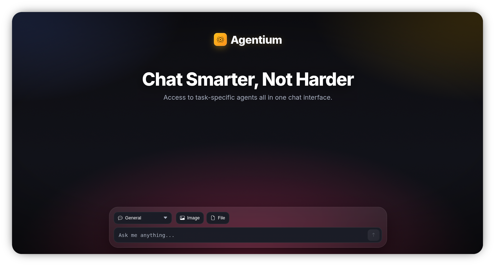

# Agentium - A Multi-Agent Chat Interface

[](https://www.google.com/search?q=https://hub.docker.com/r/kayozxo/agentium)

Agentium is a sleek, modern chat application powered by a FastAPI backend that allows you to interact with multiple specialized AI agents. Built for speed and efficiency, it leverages the high-speed Groq™ LPU Inference Engine to deliver near-instant responses.

This project is fully containerized with Docker, allowing for a simple, one-command setup.

## Screenshot

<p align="center">  </p>

## Key Features

- **Blazing Fast:** Powered by the Groq LPU™ Inference Engine for real-time conversations.
- **Multiple Specialized Agents:** Seamlessly switch between different AI agents tailored for specific tasks:
  - **General Chat:** For all-purpose questions, brainstorming, and assistance.
  - **Web Search:** For research and retrieving live information from the web.
  - **YouTube:** For summarizing and analyzing YouTube video content.
  - **Article:** For in-depth analysis and summarization of articles and text.
  - **LinkedIn:** For generating professional posts and content suitable for LinkedIn.
- **Image Understanding:** The General agent can process and answer questions about images you upload.
- **Dockerized:** One-command deployment. No need to worry about managing Python dependencies manually.
- **Clean UI:** A modern, responsive interface built with HTML, CSS, and JavaScript.

---

## Technology Stack

- **Backend:** Python + FastAPI
- **AI Engine:** Groq API
- **Containerization:** Docker
- **Web Server:** Uvicorn
- **Frontend:** HTML5, CSS3, vanilla JavaScript

---

## Getting Started

There are two ways to run this application: using Docker (recommended for ease of use) or setting it up locally for development.

### Prerequisites

- **Groq API Key:** You will need an API key from Groq. You can sign up for a free account at [console.groq.com](https://console.groq.com/).
- **Docker:** (Required for the Docker method) Install Docker from the official [Docker website](https://www.docker.com/products/docker-desktop/).
- **Python 3.15.5+:** (Required for the local setup method)

### 🐳 Running with Docker (Recommended)

This is the simplest way to get the application running.

1.  **Pull the image from Docker Hub:**

    ```bash
    docker pull kayozxo/agentium:latest
    ```

2.  **Run the container:**
    Execute the following command in your terminal. Replace `your_groq_api_key_goes_here` with the key you obtained from Groq.

    ```bash
    docker run -d -p 8000:8000 -e GROQ_API_KEY="your_groq_api_key_goes_here" --name agentium kayozxo/agentium:latest
    ```

3.  **Access the Application:**
    Once the container is running, open your web browser and navigate to **`http://localhost:8000`**.

---

### 💻 Running Locally for Development

Follow these steps if you want to run the application locally without Docker.

1.  **Clone the Repository:**

    ```bash
    git clone https://github.com/kayozxo/Agentium.git
    cd Agentium
    ```

2.  **Create a Virtual Environment:**

    ```bash
    python -m venv venv
    source venv/bin/activate  # On Windows, use `venv\Scripts\activate`
    ```

3.  **Install Dependencies:**

    ```bash
    pip install -r requirements.txt
    ```

4.  **Set Up Environment Variable:**
    Create a file named `.env` in the project's root directory and add your API key to it:

    ```
    GROQ_API_KEY="your_groq_api_key_goes_here"
    ```

5.  **Run the Application:**

    ```bash
    uvicorn main:app --reload
    ```

6.  **Access the Application:**
    The application will be available at **`http://localhost:8000`**.

---

## License

This project is licensed under the MIT License. See the `LICENSE` file for details.
